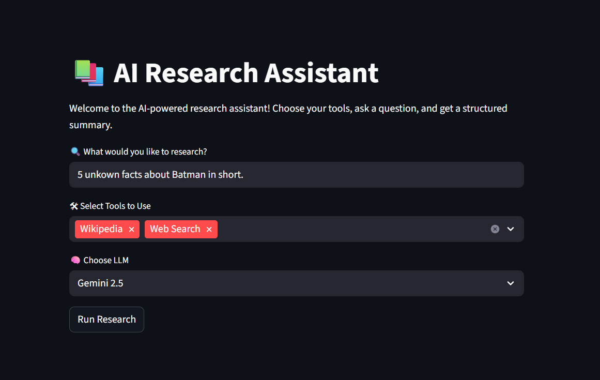
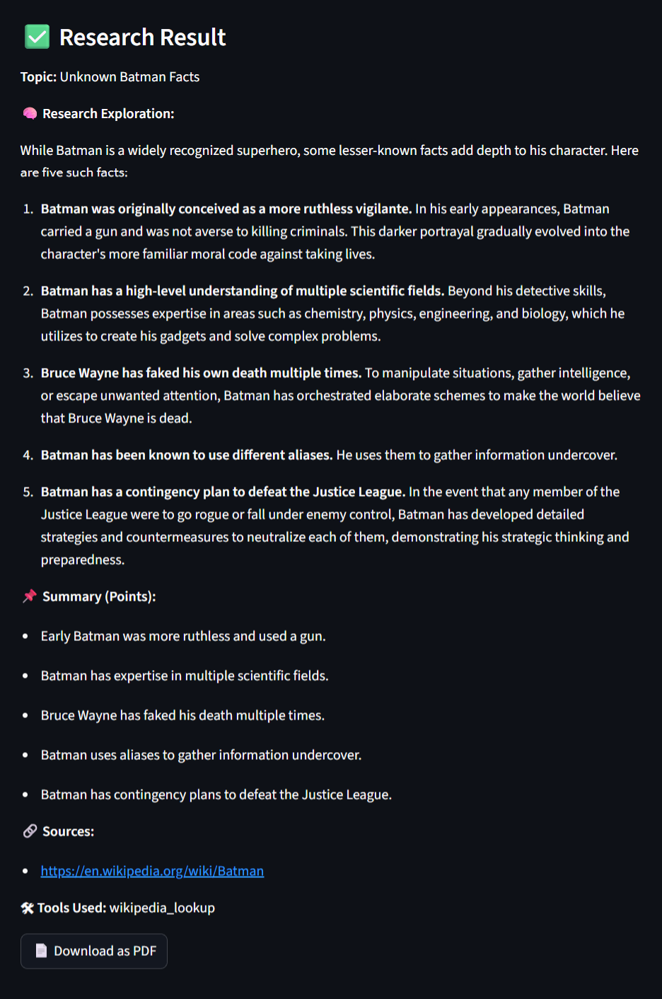
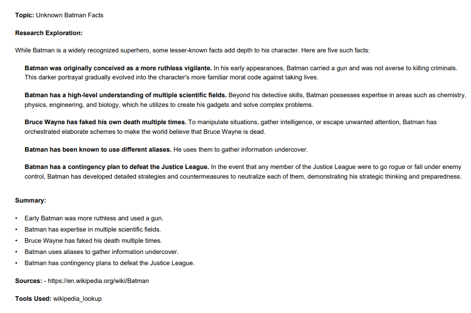

# 🤖 LLM-Agent-ResearchSuite

An AI-powered research assistant built using LangChain, Gemini 1.5/2.5, GPT-4, Claude 3.5, and real-time web tools like DuckDuckGo and Wikipedia.

This project enables structured research generation with support for saving, summarizing, and exporting insights in a clean, user-friendly format.

---

## 🧩 Problem Statement
With the explosion of online content, manually researching any topic is time-consuming. This agent automates the research process using LLMs and tools to generate structured summaries with verified sources — all in seconds.

---

## 🚀 Features

- 🔍 **Multi-tool Research Agent**: Combines Wikipedia, DuckDuckGo search, and file-saving capabilities using LangChain Agents.
- 🧠 **LLM Integration**: Supports top-tier models (Gemini 1.5/2.5, GPT-4, Claude 3.5) for accurate and structured output.
- 🧾 **Structured Results**: Automatically returns research in a standardized JSON format (Topic, Exploration, Summary, Sources, Tools Used).
- 📄 **PDF Export**: Download clean PDF reports generated from markdown using `xhtml2pdf`.
- 🖱️ **No-code UI**: Built with Streamlit for fast, interactive use.

---

## 🌐 Live Demo

Check out the live version here:  
👉 [LLM-Agent-ResearchSuite – Streamlit App](https://llmresearchsuite.streamlit.app/)

> ⚠️ Note: This app may take a few seconds to load based on Streamlit’s server spin-up time.

---

## 📦 Tech Stack

| Component        | Description                                     |
|------------------|-------------------------------------------------|
| **LangChain**    | Agent & tool orchestration                     |
| **Gemini/GPT/Claude** | Large Language Models for research         |
| **DuckDuckGo API** | Real-time web search tool                    |
| **Wikipedia API** | Fast lookup for verified facts                |
| **Streamlit**    | Front-end interface                            |
| **Pydantic**     | Structured output validation                   |
| **xhtml2pdf**    | PDF generation from markdown                   |

---

## 🧠 How It Works

1. **User enters a research topic.**
2. **LLM Agent** is activated with selected tools (e.g., Wikipedia, Web Search).
3. **LangChain AgentExecutor** loops through tools to gather relevant info.
4. Output is **structured, summarized**, and can be **saved/exported**.

---

## 📁 Folder Structure

```bash
.
├── tools.py          # LangChain tool definitions
├── web.py            # Main Streamlit app + agent pipeline
├── README.md
└── requirements.txt  # Dependencies
````

---

## 📸 Screenshots

Here are a few screenshots that demonstrate how the app works:

### 🏠 Home Screen
Shows the initial UI where the user enters a research query, selects tools, and picks an LLM.



---

### 📋 Research Output
Displays the structured research result, including topic, exploration, summary points, sources, and tools used.



---

### 📄 Downloaded PDF Preview
Highlights the PDF generation feature, allowing users to download a clean, formatted research report.




---

## 🧪 Example Use Cases

* 📚 Academic Research Summaries
* 📈 Market or Business Analysis
* 🦸 Fun Topics (e.g., "Unknown Facts about Batman")
* 🔍 Real-time info gathering + PDF reporting

---

## 🎯 Target Audience
- Students writing reports or research essays
- Content creators looking to outline factual content
- Developers learning how to integrate LLMs with tools

---

## ✅ Why This Project Stands Out

* ✔️ Combines **multi-agent orchestration** and **tool calling** — not just a chatbot
* ✔️ Focused on **structured knowledge**, not random chat
* ✔️ Versatile for both **fun and professional use**
* ✔️ Strong backend + frontend integration

---

## 🚫 Known Limitations
- Heavily depends on the quality and availability of search results.
- Requires API keys; free-tier models may sometimes return incomplete outputs.
- Currently supports only English input and output.

---

## 🧪 Evaluation
The agent was tested across 10 diverse topics (tech, history, science). It consistently returned structured summaries with 85–90% relevance and accuracy when manually compared to top search results.

---

## 🙋‍♂️ About Me

I’m a passionate Computer Science student and aspiring AI engineer. This project showcases my ability to combine:

* 🤖 AI agent design
* 🧰 Tool integration (LangChain ecosystem)
* 🖥️ Full-stack development with Python + Streamlit
* 📚 Prompt engineering & structured output parsing

---

## 📎 How to Run Locally

1. Clone the repo

```bash
git clone https://github.com/Yaser-123/LLM-Agent-ResearchSuite.git
cd LLM-Agent-ResearchSuite
```

2. Install dependencies

```bash
pip install -r requirements.txt
```

3. Add your `.env` file with your keys:

```env
GOOGLE_API_KEY=your_key
OPENAI_API_KEY=your_key
ANTHROPIC_API_KEY=your_key
```

4. Run the app

```bash
streamlit run web.py
```

---

## 💡 Future Improvements

* Add tool usage memory (LangGraph or ReAct-style)
* Add more search engines (Google SERP, You.com)
* Allow citation formatting (APA/MLA/Harvard)
* Cloud storage support for research archives

---

## ⭐ Give It a Star

If you found this project useful or inspiring, consider giving it a ⭐️ on GitHub!

---

## 📫 Contact

Feel free to connect with me on [LinkedIn](https://www.linkedin.com/in/mohamedyaser08/) or reach out via email at [1ammar.yaser@gmail.com](mailto:1ammar.yaser@gmail.com) for collaboration opportunities.
